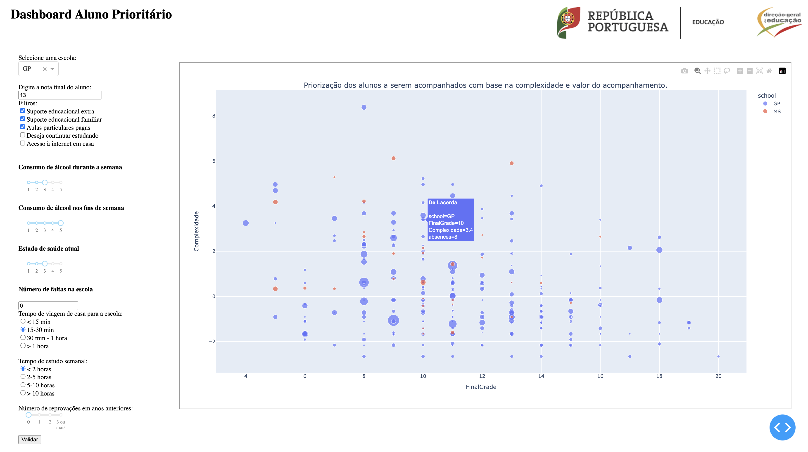

# Projet "Aluno Prioritario"

Le Ministère de l'Éducation portugais a contacté notre équipe avec l'idée d'utiliser la data et l'IA pour aider à remédier à la chute du niveau scolaire constaté à la suite de la fermeture des écoles. L'idée est de fournir un outil permettant aux conseillers pédagogiques de chaque établissement de prioriser les élèves à accompagner en fonction de la complexité et de la valeur (note finale) d'un tel accompagnement. 

Dans ce projet, une première version de l'outil est proposée afin qu'elle puisse être testée dans deux écoles pilotes. 
Ce dashboard pourrait se centrer autour d'un graphe permettant de visualiser l'ensemble des élèves de l'établissement suivant deux axes.

## Choix techniques

- Python
- Dash 
- Jenkins (outil d'intégration continue et de déploiement continu (CI/CD))
- Docker (conteneurisation)

L'utilisation de Python et de Dash permet de développer rapidement une application interactive et facile à utiliser pour les utilisateurs. 
Jenkins facilite l'automatisation du processus de déploiement et de mise à jour de l'application, tandis que Docker facilite le déploiement de l'application sur différents environnements et serveurs.

## Structure du projet

- `app1/`: dossier contenant un premier script `aluno_prioritario1.py`. permettant de lancer une première application permettant de visualiser l'ensemble des étudiants et la prédiction d'une variable symobilsant la complexité à les accompagner selon leur note finale mais aussi d'autres critères telles que l'implication des élèves, le soutien famiial etc... 
A terme, l'utilisateur de l'application pourra saisir les caractéristiques d'un identifiant.
Pour des contraintes de temps, l'inférence du modèle prédisant la notion de 'complexité' n'a pas encoe été réalisée et sera déployée dans une V2 permettant de mettre à jour le graphe de façon dynamique avec de nouvelles données saisies par l'utilisateur.

- `app2/`: dossier contenant un deuxième script `clusters.py`: La visualisation de données est basée sur un modèle de clustering KMeans appliqué à l'ensemble de données d'étudiants. Les variables d'entrée peuvent être sélectionnées à l'aide de menus déroulants dans le tableau de bord. La visualisation des données est affichée dans un graphique interactif, qui peut être mis à jour en temps réel en fonction des choix de l'utilisateur dans les menus déroulants. Le graphique affiche les clusters et les centres de cluster pour les variables d'entrée sélectionnées.

- `notebooks/`: dossier contenant les notebooks utilisés pour explorer les données contenant 2 sous dossiers `01_exploration/` et `02_models/`

## Installation

Les premières étapes sont communes:
1. Cloner le dépôt git: `git clone https://github.com/sbouden/aluno_prioritario.git`
2. Naviguer dans le répertoire du projet: `cd aluno_prioritario`
3. Changer de branche avec : `git checkout apps`

Ensuite plusieurs méthodes sont possibles:

### Avec la création d'un virtualenv et installation des prérequis
1. `cd myenv`
2. `virtualenv myenv`
3. `source myenv/bin/activate`
4. `pip install virtualenv`
5. `pip install --upgrade packaging`
6. `mkdir myenv`
7. `cd myenv`
8. `source myenv/bin/activate`
9. Installer les dépendances avec `pip install --no-cache-dir -r app1/requirements.txt && pip install --no-cache-dir -r app2/requirements.txt`
10. `cd app1` ou `cd app2`
11. `python aluno_prioritario1.py` ou respectivement  `python clusters.py`

### Avec Docker
4. `cd app1`
5. Vérifier avec `docker --version` que docker est installé sur votre machine
6. Sur un terminal, `docker build -t nom_de_votre_image . ` (le point est bien à mettre)
7. Lancer un conteneur à partir de cette image en utilisant : `docker run -p 8050:8050 nom_de_votre_image`
8. Ouvrir un navigateur web et aller sur http://localhost:8050 pour accéder à l'application Dash exécutée dans le conteneur Docker

Réitérer les mêmes étapes pour accéder à la 2ème application:

4. `cd app2`
5. Vérifier avec `docker --version` que docker est installé sur votre machine
6. Sur un terminal, `docker build -t nom_de_votre_image . `(le point est bien à mettre)
7. Lancer un conteneur à partir de cette image en utilisant : `docker run -p 8888:8888 nom_de_votre_image`
8. Ouvrir un navigateur web et aller sur http://127.0.0.1:8888/ pour accéder à l'application Dash exécutée dans le conteneur Docker

### Avec Jenkins
Le `jenkinsfile.groovy` définit les étapes de la pipeline de déploiement. Celles-ci incluent l'installation de docker, la construction de l'image docker, la prise en compte du dockerfile et l'installation des prérequis, dépendances et l'exécution de l'application.

4. Cloner le repo Git contenant le Jenkinsfile et le Dockerfile sur sa machine
5. Créer un projet Jenkins pour cette pipeline. Cela peut être fait en passant par l'interface graphique du navigateur et en créant un nouveau projet Jenkins de type "Pipeline script from SCM". On peut y ajouter le script de la pipeline, qui sera stocké dans un SCM (comme Git) et Jenkins pourra le récupérer pour l'exécuter. Si vous n'avez pas accès à l'interface web de votre serveur Jenkins pour lancer un build, vous pouvez utiliser la commande `jenkins build jenkinsfile.groovy`